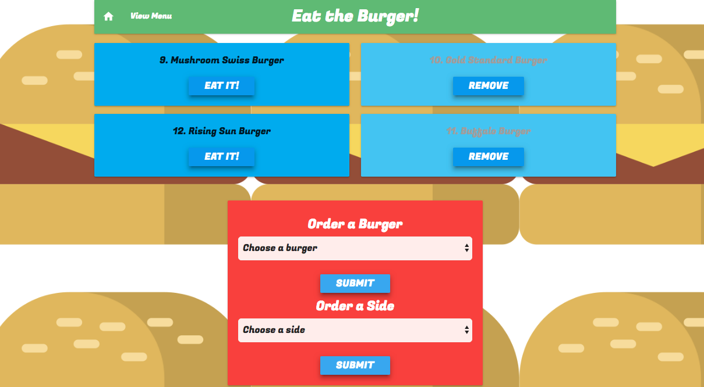
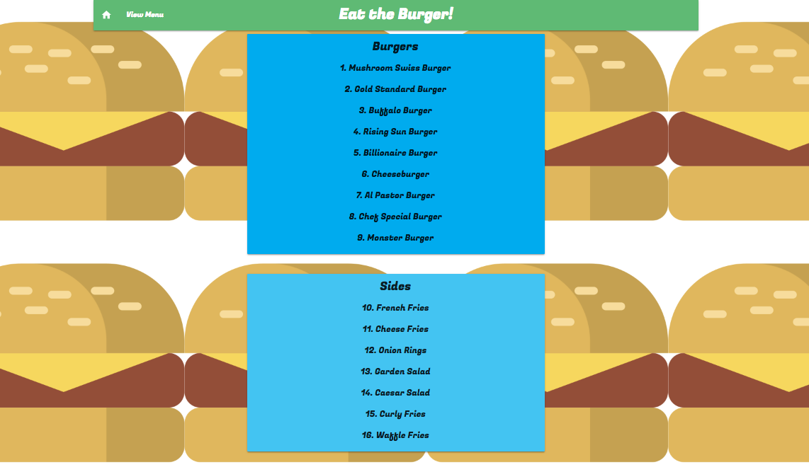

# Eat the Burger!

Created during Week 14 of DU Coding Bootcamp. The goal was to create a Burger App using Node Express Handlebars and our own ORM. It uses the MVC design pattern, Node and MySQL to query and route data to the app and Handlebars to generate the HTML.

## Screen Shots


Main Page


Menu Page - Displays all available Burgers and Sides

## Technologies used
- Node.js
- MySQL
- Handlebars - http://handlebarsjs.com/
- body-parser NPM Package - https://www.npmjs.com/package/inquirer
- express NPM Package - https://www.npmjs.com/package/express
- mysql NPM Package - https://www.npmjs.com/package/mysql
- handlebars NPM Package - https://www.npmjs.com/package/handlebars
- express-handlbars NPM Package - https://www.npmjs.com/package/express-handlebars

### Prerequisites

```
- Node.js - Download the latest version of Node https://nodejs.org/en/
- Materialize - Add CDN link http://materializecss.com/getting-started.html
```

## Authors

* **Jamie Alary** - *JS/Node.js/Handlebars* - [Jamie Alary](https://github.com/alaryj)